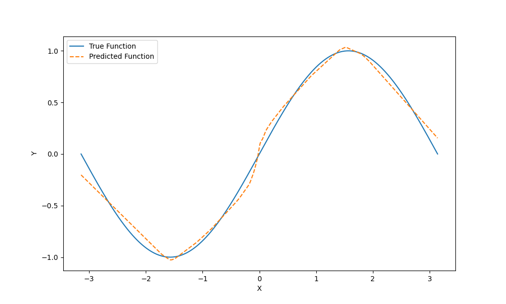

## 2251929 姚胤晟 基于ReLU的神经网络拟合函数实验报告

### 一. 函数定义 

该代码实现了一个简单的前馈神经网络（SimpleNeuralNetwork）来拟合正弦函数。主要的函数包括：
- `__init__(self, input_size, hidden_size, output_size)`: 初始化神经网络，包括权重和偏置的初始化，使用 Xavier 方法来提高训练稳定性。同时初始化 Adam 优化器所需的动量项和二阶矩估计

- `relu(self, Z)`: 计算 ReLU（修正线性单元）激活函数，以增强模型的非线性表达能力

- `d_relu(self, Z)`: 计算 ReLU 的导数，用于反向传播中更新参数

- `forward(self, x)`: 实现前向传播，计算隐藏层的激活值和输出层的预测值

- `compute_loss(self, y_true, y_pred)`: 计算均方误差（MSE）损失，用于衡量预测值与真实值之间的差距

- `backward(self, x, y, learning_rate, t)`: 计算损失对参数的梯度，更新神经网络的权重和偏置，采用 Adam 优化算法进行自适应调整

- `train(self, x_train, y_train, epochs, learning_rate, decay_rate, patience)`: 训练模型，包含学习率衰减和早停机制，防止过拟合并提高模型的泛化能力

- `target_function(x)`: 目标函数，返回 sin(x)，作为拟合的目标

### 二. 数据采集

代码生成了一个用于训练和测试的正弦函数数据集

- x_train: 在 [-pi, pi] 区间内均匀采样 700 个点，作为训练数据

- y_train: 计算 x_train 对应的 sin(x) 值，作为训练标签

- x_test: 生成 300 个测试数据点，用于评估模型的泛化能力

- y_test: 计算 x_test 对应的 sin(x) 真实值，作为测试集的标签

### 三. 模型描述

该神经网络是一个三层前馈神经网络，结构如下：

- 输入层：1 个神经元，输入 x

- 隐藏层：64 个神经元，使用 ReLU 作为激活函数

- 输出层：1 个神经元，直接输出回归结果

同时，为了加速模型训练，采用部分优化策略：

- 使用 Xavier 方法初始化权重，以保持梯度稳定

- 采用 Adam 自适应优化算法，同时使用一阶动量（梯度的指数加权平均）和二阶矩估计（梯度平方的指数加权平均）来动态调整学习率，提高收敛速度

- 采用指数衰减策略，学习率随着训练进程逐步减少，以提升模型的稳定性

- 采用早停机制。设定 patience=5000，如果连续 5000 轮损失没有下降，则终止训练

### 四. 拟合效果

可以看出，神经网络模型成功拟合了 sin(x) 函数。从拟合效果图来看，预测曲线（橙色虚线）与真实曲线（蓝色实线）整体吻合较好，尤其是在 x 处于中心区域时，预测值与真实值高度重合。然而，在边缘区域（x 接近 -π 和 π）存在一定偏差，说明模型对边界数据的拟合能力仍有优化空间。整体来看，神经网络模型较好地学习到了 sin(x) 的特性，在未见过的测试集上也保持了良好的泛化能力。