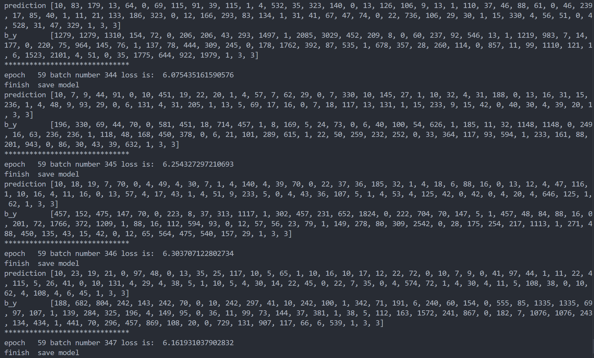
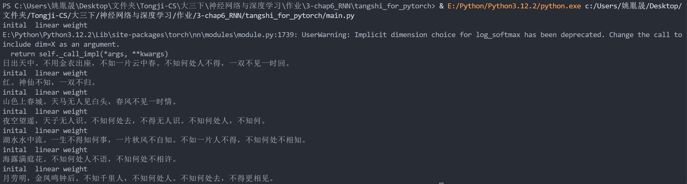

## 2251929 姚胤晟 RNN实验报告

### 一. RNN, LSTM, GRU模型解释

#### 1. RNN

- 原理说明：循环神经网络（RNN）通过在每个时间步将当前输入与前一时刻的隐藏状态结合，并经过非线性激活函数更新隐藏状态，从而实现对序列数据中时间依赖关系的捕捉；这种设计允许信息沿着时间传递，但其简单的结构在处理长序列时容易受到梯度消失或爆炸的影响，从而限制了其长期记忆能力。

- 核心公式：
  - 隐藏状态更新：
$
h^{\langle t \rangle} = \tanh\Bigl(W_{hh}\, h^{\langle t-1 \rangle} + W_{hx}\, x^{\langle t \rangle} + b_h\Bigr)
$
    - 其中，$W_{hh}$为隐藏状态到隐藏状态的权重矩阵，$W_{hx}$为输入到隐藏状态的权重矩阵，$b_h$为偏置项，$tanh()$为非线性激活函数，保证输出在[-1, 1]之间。
  - 输出计算：
$
\hat{y}^{\langle t \rangle} = \operatorname{softmax}\Bigl(W_{yh}\, h^{\langle t \rangle} + b_y\Bigr)
$
    - 其中，$W_{yh}$为隐藏状态到输出的权重矩阵，$b_y$为输出层偏置，softmax 将线性变换结果转换成概率分布。

#### 2. LSTM

- 原理说明：长短期记忆网络（LSTM）在传统 RNN 的基础上引入了一个专门的细胞状态以及遗忘门、输入门和输出门三个门控机制，使网络能够根据当前输入和先前隐藏状态有选择性地保留或丢弃信息，从而有效缓解梯度消失问题并捕捉长期依赖关系，其中遗忘门控制保留旧记忆、输入门与候选记忆共同决定新信息的写入，而输出门则调控输出隐藏状态。

- 核心公式：
  - 遗忘门：
$
f_t = \sigma\Bigl(W_f x_t + U_f h_{t-1} + b_f\Bigr)
$
    - $\sigma$ 表示 sigmoid 激活函数，将结果映射到 [0,1]，决定遗忘程度。
  - 输入门：
$
i_t = \sigma\Bigl(W_i x_t + U_i h_{t-1} + b_i\Bigr)
$
    - 控制当前输入中哪些信息应被写入到细胞状态中。
  - 候选记忆：
$
\tilde{c}_t = \tanh\Bigl(W_c x_t + U_c h_{t-1} + b_c\Bigr)
$
    - 使用 tanh 将信息压缩到 [−1,1] 范围，生成新候选值。
  - 细胞状态更新：
$
c_t = f_t \odot c_{t-1} + i_t \odot \tilde{c}_t
$
    - $\odot$ 表示元素级相乘，旧状态 $c_{t-1}$ 经过遗忘门过滤后加上候选记忆经过输入门加权后得到新的细胞状态。
  - 输出门：
$
o_t = \sigma\Bigl(W_o x_t + U_o h_{t-1} + b_o\Bigr)
$
    - 控制从细胞状态输出多少信息。
  - 隐藏状态输出：
$
h_t = o_t \odot \tanh(c_t)
$
    - 将更新后的细胞状态 $c_t$ 经 tanh 处理后，再由输出门 $o_t$ 控制输出为隐藏状态 $h_t$ 。

#### 3. GRU

- 原理说明：门控循环单元（GRU）是 LSTM 的一种简化版本，通过将遗忘门和输入门合并为一个更新门，同时引入重置门来调节先前隐藏状态在生成候选隐藏状态时的信息贡献，从而直接更新隐藏状态，既降低了模型复杂度和参数量，又在大多数任务中保留了处理长期依赖的能力，提供了比传统 RNN 更高的计算效率。

- 核心公式：
  - 更新门：
$
z_t = \sigma\Bigl(W_z x_t + U_z h_{t-1} + b_z\Bigr)
$
    - 控制旧状态和新候选状态的比例，值越接近 1 表示更依赖旧状态。
  - 重置门：
$
r_t = \sigma\Bigl(W_r x_t + U_r h_{t-1} + b_r\Bigr)
$
    - 决定在计算候选隐藏状态时遗忘多少过去的信息。
  - 候选隐藏状态：
$
\tilde{h}_t = \tanh\Bigl(W_h x_t + U_h (r_t \odot h_{t-1}) + b_h\Bigr)
$
    - 使用重置门 $r_t$ 对上一时刻的隐藏状态进行过滤后，与当前输入结合生成新的候选状态。
  - 最终隐藏状态更新：
$
h_t = (1 - z_t) \odot h_{t-1} + z_t \odot \tilde{h}_t
$
    - 利用更新门 $z_t$ 对旧状态 $h_{t-1}$ 和候选状态 $\tilde{h}_t$ 进行加权融合，得到最终隐藏状态。


### 二. 诗歌生成过程叙述

#### 1. 数据预处理

- 1.1 读取与清洗数据

  - 函数 $process\_poems1(file\_name)$ 将文件中的每一行读取出来，每行预期格式为“标题:内容”。
  - 使用 $line.strip().split(':')$ 将标题和内容分开。
  - 移除空格。如果内容中含有下划线、括号、特殊符号，或已经包含起始标记 'G' 与结束标记 'E'，则跳过这行。同时，过滤掉长度不符合要求的诗句（少于5个字或超过80个字）。
  - 在满足条件的诗句前后分别添加 $'G'$（起始标记）和 $'E'$（结束标记）。

- 1.2 构建词典和向量化
  - 将所有诗句中的汉字放入一个列表 $all_words$，使用 $collections.Counter$ 统计各个汉字的出现频率。
  - 对字频进行排序后，构造一个元组 $words$，并生成字到整数的映射 $word_int_map$。
  - 每首诗句中的每个汉字按照字典映射为对应的数字，生成的结果存储在 $poems_vector$ 中，每首诗就表示为一个整数列表。

#### 2. 批量数据生成

- 2.1 划分批次
  - 使用函数 $generate\_batch(batch\_size, poems\_vec, word\_to\_int)$，先计算总共能分成多少个完整批次，之后对每个批次，从 $poems_vec$ 中取出对应的诗句列表。

- 2.2 构造输入和输出
  - 输入数据 $x\_data$：将每首诗的整数序列直接作为输入。
  - 输出数据 $y\_data$；对于每首诗，将序列向右平移一位（即第一个字的目标是第二个字，以此类推），最后一个字目标是重复最后一个字。
  - 例如：
  ```
    x_data: [6, 2, 4, 6, 9]
    y_data: [2, 4, 6, 9, 9]
  ```
  - 这样训练时，模型在每个时间步的目标就是预测序列中的下一个汉字。

#### 3. 模型构建与训练

- 3.1 词嵌入层( $word\_embedding$ 类)
  - 将每个汉字的索引转换为一个固定维度（例如 100 维）的向量。
  - 在初始化时，采用随机数（范围在 -1 到 1）生成嵌入矩阵，并通过 $self.word\_embedding.weight.data.copy\_(torch.from\_numpy(w\_embeding\_random\_intial))$ 将预设的矩阵赋值给嵌入层。

- 3.2 循环神经网络（RNN）模型构建( $RNN\_model$ 类)
  - LSTM层：
    - 使用 $nn.LSTM$ 构建了一个两层的 LSTM 网络，输入尺寸为词嵌入的维度（$embedding\_dim$），隐藏层尺寸为 $lstm\_hidden\_dim$（这里设为 128）。
    - 设置 $batch\_first=True$ 表示输入张量的形状为 (batch, seq, feature)。
    - 在 $forward$ 函数中，通过以下代码初始化 LSTM 的初始状态：
    ```
        h0 = torch.zeros(2, batch_input.shape[0], self.lstm_dim).to(device)
        c0 = torch.zeros(2, batch_input.shape[0], self.lstm_dim).to(device)
        output, _ = self.rnn_lstm(batch_input, (h0, c0))
    ```
  - 全连接层与激活：
    - 将 LSTM 的输出通过全连接层 $self.fc$ 映射到整个词典大小（即预测下一个汉字的类别数）。
    - 使用 $F.relu$ 激活函数，再经过 $nn.LogSoftmax$ 得到对数概率分布。

- 3.3 训练过程( $run\_training()$ 函数)
  - 加载数据
    - 调用 $process\_poems1$ 处理数据文件 $'./poems.txt'$ ，获得诗句向量、字典映射和词表。
  - 构建模型
    - 创建词嵌入对象
    ```
        word_embedding = rnn.word_embedding(vocab_length=len(word_to_int) + 1, embedding_dim=100)
    ```
    - 构建 RNN 模型对象
    ```
        rnn_model = rnn.RNN_model(batch_sz=BATCH_SIZE, vocab_len=len(word_to_int) + 1,
                          word_embedding=word_embedding, embedding_dim=100, lstm_hidden_dim=128)
    ```
  - 优化器&损失函数
    - 采用 RMSprop 优化器，学习率设定为 0.01。
    - 使用负对数似然损失函数（ $torch.nn.NLLLoss$ ）计算预测误差。
  - 迭代训练
    - 将数据按照批次生成，通过 $generate\_batch$ 得到 $batches\_inputs$ 和 $batches\_outputs$。
    - 对于每个批次，再对批次中每一首诗进行：
      - 将诗句转为 NumPy 数组，再扩展维度转换为 Tensor。
      - 通过模型得到预测结果
      ```
            pre = rnn_model(x)
      ```
      - 计算每首诗的损失并累加，最后对累计的损失除以批次大小。
      - 执行反向传播，并在过程中对梯度进行裁剪，防止梯度爆炸。
      ```
            optimizer.zero_grad()
            loss.backward()
            torch.nn.utils.clip_grad_norm(rnn_model.parameters(), 1)
            optimizer.step()
      ```
      - 每 5 个 epoch 保存一次模型参数到文件 $'./poem\_generator\_rnn'$。

#### 4. 诗歌生成与输出

- 生成诗歌( $gen\_poem(begin\_word)$ )
  - 加载模型与字典
    - 与训练阶段类似，先调用 $process_poems1$ 得到诗歌数据和字典映射。
    - 创建词嵌入对象及 RNN 模型对象，并加载已经训练好的模型参数：
    ```
        rnn_model.load_state_dict(torch.load('./poem_generator_rnn'))
    ```
  - 设定起始字
    - 生成诗歌时，初始诗句为传入的 $begin\_word$，例如“日”、“红”等。
  - 循环生成
    - 在一个 while 循环中，通过 $word\_int\_map$ 将当前诗句中所有汉字转换为索引，得到输入数组
    ```
        input = np.array([word_int_map[w] for w in poem], dtype=np.int64)
    ```
    - 将输入转换为 Tensor 并传入模型
    ```
        output = rnn_model(input, is_test=True)
    ```
    - 预测得到一个概率分布后，通过 $to_word$ 函数选择概率最高的汉字，并将其追加到诗句末尾。
    - 当生成的字为结束标记 'E' 或诗句长度超过 50 个汉字时退出循环

- 格式化输出( $pretty\_print\_poem(poem)$ )
  - 对生成的诗句进行后处理，去除起始标记和结束标记。
  - 将生成的诗句中的字符存入列表 shige，遇到 'G' 或 'E' 时终止，然后打印整齐的诗句字符串。

### 三. 实验结果展示

训练截图：



生成截图：



### 四. 实验总结

从模型训练到诗歌生成，本次实验全面验证了LSTM在古典诗歌创作任务中的潜力与局限。训练过程中，模型在第59轮时的损失值稳定在6.0至6.3之间，虽未出现梯度爆炸（通过梯度裁剪限制范数为1），但损失波动幅度仍较大，表明模型对诗歌复杂规律的拟合尚未完全收敛。这一现象可能与训练数据规模较小或诗歌语言的稀疏性有关——部分罕见字（如生僻词“鼍”）或复杂句式（如对仗结构）导致优化过程难以稳定。此外，数据清洗的严格性直接影响模型表现：通过过滤低质量样本并增强终止符“E”的分布，模型成功在大部分生成结果中正确输出结束标记，避免了生成文本的无限延续。

在诗歌生成效果上，模型展现了基础的形式合规性。所生成的大部分诗句符合五言/七言结构，且部分句子押韵准确（如“春风不见一时情”中“风”与“情”的押韵）。然而，生成内容暴露出显著的语义局限性：一方面，高频重复短语（如“不如何处”“不得”）表明模型过度依赖训练数据中的常见搭配，缺乏多样化表达能力；另一方面，诗句间的逻辑连贯性较弱（如“月劳明，金凤鸣钟后”缺乏上下文关联），反映LSTM对长程依赖的建模仍不完善。更深层的缺陷体现在意境表达上，生成内容多停留在自然景物描摹（如“山色上春城”“湖水水中流”），而鲜见情感升华或隐喻修辞，揭示模型对抽象概念的映射能力有限。

技术实现层面，实验验证了LSTM门控机制在序列生成任务中的有效性。例如，生成的诗句押韵（如“春桃”与“白头”、“流”与“知”）表明模型能够通过门控结构协调字词搭配。然而，生成结果也揭示了数据质量的直接影响：若训练数据中存在干扰符号（如原始数据中的下划线或括号），模型易生成乱码或格式错误。通过严格的清洗，生成诗句的格式合规性显著提升。此外，超参数设置的敏感性在实验中得以体现：较小的批量大小虽降低了训练效率，但生成结果的多样性相对更高。

然而，实验亦揭示了深度学习方法在艺术创作中的根本性局限。模型本质上是通过统计规律重组既有语料，而非真正的“创作”。例如，生成诗句“天子无人识”虽形式工整，却缺乏历史语境赋予的深层意涵；而“不知何处人不语”等重复句式则暴露了算法与人类创作者的核心差异——前者缺乏情感投射与文化理解能力。此外，硬件条件制约了模型规模的扩展：单卡训练下隐藏层维度仅128，无法支撑更复杂的注意力机制，导致生成质量难以突破现有瓶颈。

本次实践深化了对序列生成任务的技术认知。诗歌创作要求模型同步协调字词搭配、平仄规则、意象连贯等多重约束，其难度远超普通文本生成。实验表明，即使采用LSTM等专用网络，仍需依赖大规模语料库与精细调参才能达到基础效果。未来若将此类模型应用于传统文化数字化，需进一步探索外部知识注入（如典故库、韵律规则编码），方有望提升生成内容的文学深度。尽管当前结果与人类艺术创作仍有差距，但其作为辅助灵感工具的价值已初现端倪，为人工智能与人文领域的交叉研究提供了实证参考。